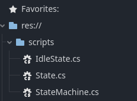
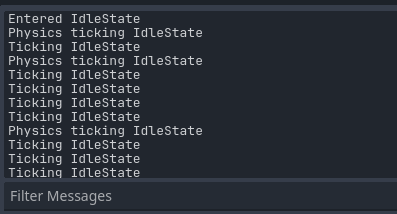

+++
title = "Godot Recipe: Finite State Machine #1"
date = 2023-10-13
description = "A walkthrough for implementing a basic FSM module in Godot C#"
draft = true

[taxonomies]
tags = ["Godot", "recipe", "C#", ".NET", "FSM", "finite state machine", "character controller"]

[extra]
footnote_backlinks = true
quick_navigation_buttons = true
+++

*Have you ever had your Character Controller code turn into proper spaghetti?*

I have -- and it's no fun.

While not a perfect cure, a **finite state machine (FSM)** can help you untangle a lot of the mess that builds up as you add more complexity to your character controller.

In this recipe series, we'll build an FSM module for Godot using C#.


The long term goal is to provide a module where an arbitrary `State` can control arbitrary `Systems` on our player character.

> 🙋🏼 If you simply want a functioning FSM for your Godot project, I suggest heading over to the [Godot Asset Library](https://godotengine.org/asset-library/asset) and searching for available FSM plugins. There is no need to reinvent the wheel, **unless you want to!**

# Scope

At the end of this post, we will end up with a state machine that logs when it enters, updates, and exits a state.

We will end up with two states that we can transition between - idle and walking.


stateDiagram
Idle-->Walking: Pressing WASD
Walking-->Idle: Not pressing WASD


In future posts, we will iterate on the module, improving the design and architecture making it more generic and more engine-agnostic - so stick around! 🙂

# Project setup

Before diving into the code, we head on over to Godot and set up some WASD mappings for movement. We'll call the actions `up`, `down`, `left` and `right`:


# A definition of State

At a first glance, we decide that our states should be able to handle logic that executes:

* Upon **entering** the state
* During idle processing -- `Node._Process(double)`
* During physics processing -- `Node._PhysicsProcess(double)`
* Upon **exiting** the state

With this in mind, we sketch up a class that looks like this:


    classDiagram
    class State {
        Enter() void
        Tick(float) void
        PhysicsTick(float) void
        Exit() void
    }


> 🙋🏼 We will notice this definition changes (see the *v1* in the header?). For now, let's keep on codin'!

## Abstract State

Next we create an abstract State class with this definition in our project. I'll just plop it down right in a scripts folder for now.


We won't be inheriting from Node, but instead make this a pure C# class. We will also have it perform some basic logging in each method. 

Replace all contents of State.cs with the following:

```cs
using Godot;

public abstract class State
{
    private string _name;

    public State() {
        _name = GetType().Name;
    }

    public virtual void Enter() {
        GD.Print($"Entered {_name}");
    }

    public virtual void Tick(double delta) {
        GD.Print($"Ticking {_name}");
    }

    public virtual void PhysicsTick(double delta) {
        GD.Print($"Physics ticking {_name}");
    }

    public virtual void Exit() {
        GD.Print($"Exiting {_name}");
    }
}
```

## IdleState

In addition to this abstract State, let's create a *concrete* one - the `IdleState`. It inherits from `State` and it does nothing except call the virtual methods on the base class, for now.

```cs
public class IdleState : State
{
    public override void Enter()
    {
        base.Enter();
    }

    public override void Tick(double delta)
    {
        base.Tick(delta);
    }

    public override void PhysicsTick(double delta)
    {
        base.PhysicsTick(delta);
    }

    public override void Exit()
    {
        base.Exit();
    }
}
```

Fantastic! We now have an IdleState that is very much idle -- all it does is log stuff. To actually use our state, we need to create the actual SM of our FSM.

Enter, the *state machine*!

# The State Machine

To enable our character to use our states, we need a controller of sorts to track and handle what state we are in and transitions to other states.

## Creating the machine

In its most simple form, a state machine is a state container that can call the state functions and change what state we are in. To make it clearly visible in the scene hierarchy, let's make it inherit from Node.

Let's sketch one up!


    classDiagram
    direction LR
    Node<|--StateMachine
    class StateMachine {
        - _currentState: State
        - DefaultState: State
        - ChangeState(State) void
    }


Similarly, we create a `StateMachine.cs` script and dunk it straight into our `scripts` folder. The story goes:

* We keep a list of all possible States in the machine and create them in the constructor.
* We decide on a default state for the machine and set it in the constructor.
* We keep track of the current state.
* We'll call the `Tick` and `PhysicsTick` state functions in `_Process` and `_PhysicsProcess` respectively.
* `ChangeState` handles calling the exit and enter logic on the states we transition between.

It looks something like this:

```cs
using Godot;

public partial class StateMachine : Node
{
    public IdleState idleState;
    public WalkingState walkingState;
    
    private State _currentState;

    public StateMachine()
    {
        idleState = new IdleState();
        walkingState = new WalkingState();

        ChangeState(idleState); // initial state
    }

    public override void _Process(double delta)
    {
        _currentState.Tick(delta);
    }

    public override void _PhysicsProcess(double delta)
    {
        _currentState.PhysicsTick(delta);
    }

    // Switches to a new state, if it is different from the current state.
    public void ChangeState(State newState)
    {
        if (newState == _currentState) return;
        _currentState?.Exit();   // perform exit logic on current state
        _currentState = newState;   // switch to new state
        _currentState.Enter();   // perform enter logic on new state!
    }
}

```

> 🙋🏼 For now, let's keep the concrete states public - this will trick us into a circular dependency very soon, but we'll break that up in a later part of this series!

Our FileSystem should look like this, at this point:



Next we'll take our State Machine for a spin!

## Testing the machine

Add a Node to your scene, and attach the `StateMachine` script. Hitting play should yield some logs:



While not particularly exciting, we are successfully idling! If you've come this far, take a short break and grab your drink of choice before continuing. Well done! ☕

Next, we'll be tackling transitioning to other states!

# State Transitions

We have states and we have a machine - all we need now is transitions between the states. It will take some refactoring, so buckle up!

## Setting up our states and machine for transitioning

Before performing a transition, we need to create another state to transition to and include it in our machine state list. Let us create a walking state as our second state.

Firstly, we create `WalkingState.cs` and put it in our `scripts` folder.

```cs
using Godot;
public class WalkingState : State
{
    public override void Enter()
    {
        base.Enter();
    }

    public override void Tick(double delta)
    {
        base.Tick(delta);
    }

    public override void PhysicsTick(double delta)
    {
        base.PhysicsTick(delta);
    }

    public override void Exit()
    {
        base.Exit();
    }
}
```

Secondly, we add it to the state list in `StateMachine.cs`.

```cs
public partial class StateMachine : Node
{
    public IdleState idleState = new IdleState();
    public WalkingState walkingState = new WalkingState(); // NEW!

    // omitting rest of file for brevity
```

Thirdly, remember that circular dependency I warned about earlier? Don't blink, because it's happening now.

To be able to change into a state from another state, we will introduce a `StateMachine` reference in our states. It will sit snugly in the abstract State class like so and be assigned in the constructor:

```cs
public abstract class State {
    private string _name;
    protected StateMachine _machine;  // NEW!

    public State(StateMachine machine) { // UPDATE!
        _name = GetType().Name;
        _machine = machine; // NEW!
    }

    // omitting rest of file for brevity
```

> 🙋🏼 While it's not pretty, it does the trick for now. I promise you we'll sort this circular dependency atrocity out in the future!

Lastly, we update our concrete state constructors to pass the StateMachine down the base constructor. We also update our state constructions in `StateMachine.cs`:

```cs
public partial class StateMachine : Node
{
    // omitted
    public StateMachine()
    {
        idleState = new IdleState(this);
        walkingState = new WalkingState(this);

    // omitted
```
```cs
public partial class IdleState : State
{
    public IdleState(StateMachine machine) : base(machine) { }  // NEW!
    // omitted   
```
```cs
public partial class WalkingState : State
{
    public WalkingState(StateMachine machine) : base(machine) { } // NEW!
    // omitted   
```

And with that, we have all the plumbing to perform state transitions! We are nearly there...

## Implementing transition conditions

We need to determine when to switch between the Idle and Walking states. For this, we tell the states that if we're moving with WASD, we should be walking. If not, we should be idling.

In `Tick` we poll for our transition condition like so:

```cs
public class IdleState : State
{
    // omitted...

    public override void Tick(double delta)
    {
        base.Tick(delta);

        if(Input.GetVector("up","down","left","right") != Vector2.Zero) {
            _machine.ChangeState(_machine.walkingState);
        }
    }

    // omitted...
}
```

```cs
public class WalkingState : State
{
    // omitted...

    public override void Tick(double delta)
    {
        base.Tick(delta);
        
        if(Input.GetVector("up","down","left","right") == Vector2.Zero) {
            _machine.ChangeState(_machine.idleState);
        }
    }

    // omitted...
}
```

At this point we have two states, a state machine and conditions in the states describing when to switch between the states.

## Testing transitions

With no fear in your heart, press F5 and take her for a spin!


Again, it might not look particularly exciting, but it's still a fully functional FSM framework that can be used to control all possible aspects of a character, if we put some more love into it.

Give yourself a compliment or two, you've earned it!

In the next part, we will break up that nasty circular dependency, add a jumping state, and add ***systems*** to our character controller, that are controlled by states.

All the best,<br/>
Nilsiker