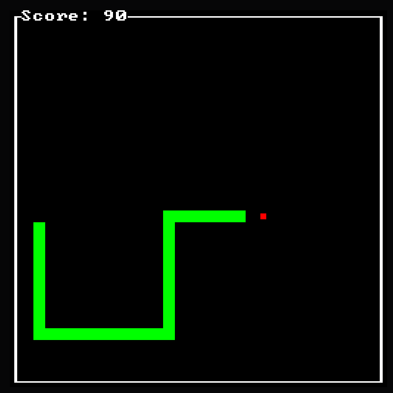

+++
title = "Making Snake using Rust and Bevy"
date = 2024-03-29
description = "A semi-guided tutorial on how to create the classic game Snake, ASCII-style using Bevy."
draft = true

[taxonomies]
tags = ["rust", "bevy", "ascii", "bevy_ascii_terminal"]

[extra]
footnote_backlinks = true
quick_navigation_buttons = true
+++

> ⚠️ This post assumes basic proficiency in Rust.
>
> The project structure used is my way of structuring Bevy projects to the best of my knowledge. It is not meant to be taken as best-practice.

# Introduction

One thing this blog is lacking at the moment is an introductory post for Bevy.

While I have briefly written about Bevy before in my [bevy_ymir](../creating-worlds-in-bevy) post, I haven't properly showcased the engine with a project, start to finish.

Let's set this straight! I recently made a by implementing Snake using [bevy](https://bevyengine.org/)! For rendering, we will use the `bevy_ascii_terminal` crate.



# Scope

In this Snake game, the following rules apply:

- The game takes place on a tile-based board
- The game progresses on game ticks.
- The player is spawned in the center of the screen facing upwards.
- At any given time, there is 1 food item on the board.
- Consumed food items increase the game tick rate and snake size.
- Player score is based on how many food items are consumed.
- The game ends when the player crashes into themselves or the board borders.

For the project structure, the file structure will try and mimic the Bevy architecture:

```
src/
├─ plugin_one/
│  ├─ data.rs
│  ├─ mod.rs
│  ├─ systems.rs
├─ plugin_two/
│  ├─ data.rs
│  ├─ mod.rs
│  ├─ systems.rs
├─ main.rs
```

We will strive to make our plugins fully independent -- this means the app should not crash even if we remove any plugin of choice.

> 🙋🏼 The app _will_ require one plugin always - our GamePlugin, which is responsible for registering core systems and signals to be used in the app.

> ⚠️ The bevy_ascii_terminal README includes a Snake implementation.
>
> In this post, I leave out SystemSets and Ordering Dependencies, and instead focus on splitting up the game into multiple plugins as a structural exercise.

# Design

Since Bevy uses an ECS architecture, our design needs to be data-oriented.

This paradigm usually lends itself toward modular solutions. I've found the best way to get going with Bevy is to identify what functionality is expected on a systems-level.

Let's try and define what systems are required and make an effort to categorize them. My take on it is this:

- **core** -- _managing the game loop, global event bus_
- **rendering** -- _drawing entities, the board, text_
- **food** -- _spawning and despawning food_
- **snake** -- _moving, consuming food, crashing_
- **input** -- _starting the game, changing snake direction_
- **score** -- _increasing and displaying the game score_

Let's get to coding!

# Implementation

Before we start on the game itself, let's add our dependencies and sanity check them!

## Rendering using the Bevy ASCII Terminal

We need two immediate depenencies as mentioned before;

```bash
cargo add bevy bevy_ascii_terminal
```

As of writing this post, the versions used are `bevy@0.13.1` and `bevy_ascii_terminal@0.15.0`

Let us prepare a PluginGroup to hold all our game plugins. We can call it SnakePlugins and put it in our `lib.rs`:

```rust
// lib.rs
use bevy::{app::PluginGroupBuilder, prelude::*};

pub struct SnakePlugins;

impl PluginGroup for SnakePlugins {
    fn build(self) -> bevy::app::PluginGroupBuilder {
        PluginGroupBuilder::start::<Self>()
    }
}
```

> 🙋🏼 A PluginGroup is a collection of plugins. Using the builder pattern, we will use plugins to compose our game.

We need plugins to populate our PluginGroup. We'll create our core plugin to hold some fundamental game data.. We'll add the `core` folder along with the `mod.rs`, `data.rs` and `systems.rs` files.

To follow the data-oriented paradigm, let's create a small component to hold our board data called `Board`:

```rust
// core/data.rs
pub struct Board {}

```
